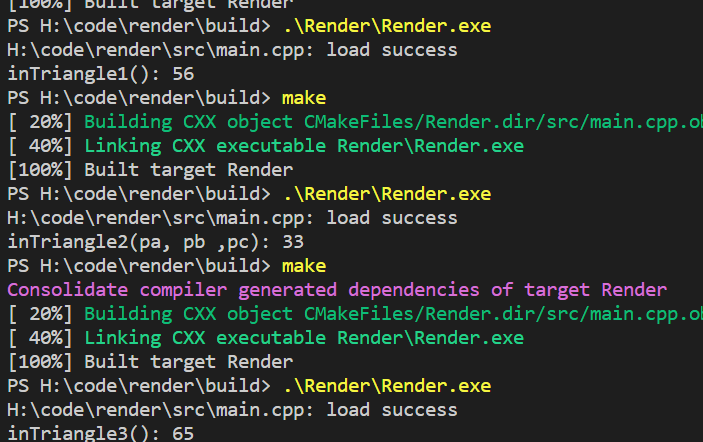

## obj文件格式解析
## tga文件生成与解析
## 数学库
- [x] 向量类
- [x] 矩阵类

## breshman 直线绘制算法
- 讲解: https://zhuanlan.zhihu.com/p/144330664

## 三角形绘制
- 向量叉乘法
- 重心坐标法
-   第一个为向量法一， 第二个为向量法二，第三个为重心坐标法
- https://zhuanlan.zhihu.com/p/106253152
- https://zhuanlan.zhihu.com/p/140907023

## 切线空间转换
- https://zhuanlan.zhihu.com/p/544988223

## TODO
- [] 跨平台，可以在Windows、macOS和Linux上运行无依赖
- [] 只使用了C标准库和系统原生API，没有外部库的依赖可编程的渲染管线
- [] 通过编写着色器（Shaders）来实现各种不同的效果
- [] 齐次裁剪（Homogeneous clipping）
- [] 透视插值（Perspective correct interpolation）
- [x] 背面剔除
  - 通过zbuffer实现
- [x] 深度测试
- [] 透明混合
- [] 天空盒
- [] 骨骼动画
- [] 切线空间
- [] 法线贴图（Tangent space normal mapping）
- [] 阴影贴图（Shadow mapping）
- [] ACES tone mapping算法
- [] 经典的Blinn–Phong反射模型
- [] 时髦的Physically based rendering（PBR）
- [] 用于环境光照的Image-based lighting（IBL）
- [] 类似于Sketchfab Viewer的环绕式相机
- [] 类似于Marmoset Viewer的材质查看器

